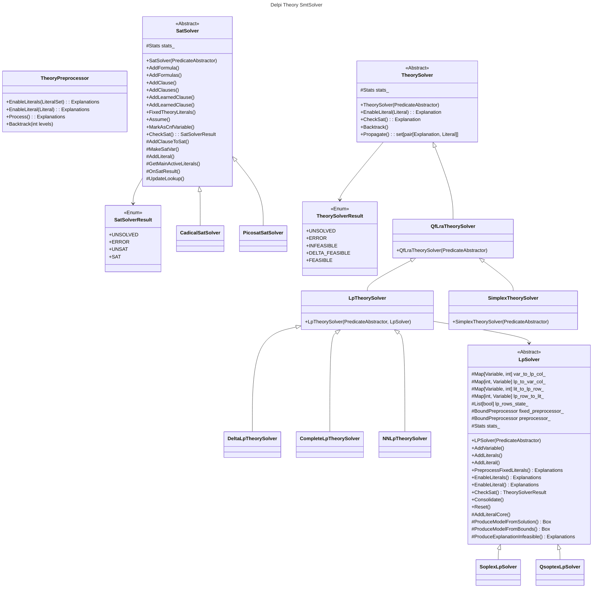
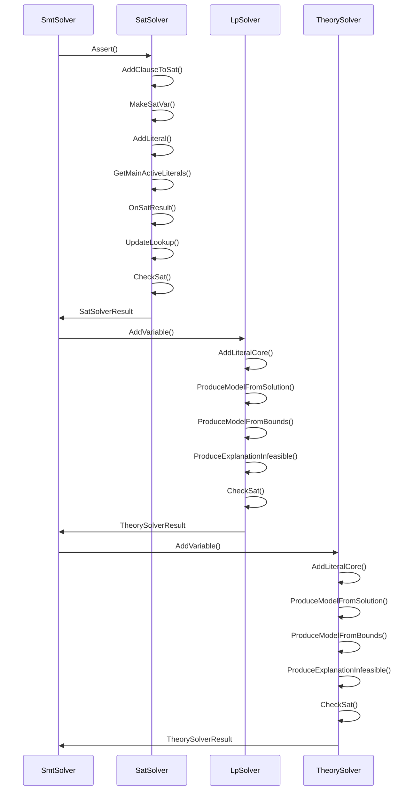

# Architecture

```mermaid
---
title: Delpi Theory SmtSolver
---
classDiagram

    class TheorySolverResult {
        <<Enum>>
        +UNSOLVED
        +ERROR
        +INFEASIBLE
        +DELTA_FEASIBLE
        +FEASIBLE
    }

    class SatSolverResult {
        <<Enum>>
        +UNSOLVED
        +ERROR
        +UNSAT
        +SAT
    }

    class TheoryPreprocessor {
        +EnableLiterals(LiteralSet): Explanations
        +EnableLiteral(Literal): Explanations
        +Process(): Explanations
        +Backtrack(int levels)
    }

    class SatSolver {
        <<Abstract>>
        #Stats stats_

        +SatSolver(PredicateAbstractor)

        +AddFormula()
        +AddFormulas()
        +AddClause()
        +AddClauses()
        +AddLearnedClause()
        +AddLearnedClause()
        +FixedTheoryLiterals()
        +Assume()
        +MarkAsCnfVariable()
        +CheckSat(): SatSolverResult
        
        #AddClauseToSat()
        #MakeSatVar()
        #AddLiteral()
        #GetMainActiveLiterals()
        #OnSatResult()
        #UpdateLookup()
    }

    class CadicalSatSolver {

    }

    class PicosatSatSolver {

    }

    class QfLraTheorySolver {
        +QfLraTheorySolver(PredicateAbstractor)
    }


    class LpSolver {
        <<Abstract>>
        #Map[Variable, int] var_to_lp_col_
        #Map[int, Variable] lp_to_var_col_
        #Map[Variable, int] lit_to_lp_row_
        #Map[int, Variable] lp_row_to_lit_
        #List[bool] lp_rows_state_

        #BoundPreprocessor fixed_preprocessor_
        #BoundPreprocessor preprocessor_
        #Stats stats_

        +LPSolver(PredicateAbstractor)

        +AddVariable()
        +AddLiterals()
        +AddLiteral()

        +PreprocessFixedLiterals() Explanations
        
        +EnableLiterals() Explanations
        +EnableLiteral() Explanations

        +CheckSat() TheorySolverResult

        +Consolidate()
        +Reset()

        #AddLiteralCore()
        #ProduceModelFromSolution() Box
        #ProduceModelFromBounds() Box
        #ProduceExplanationInfeasible() Explanations
    }
    

    class SoplexLpSolver {

    }

    class QsoptexLpSolver {

    }

    class TheorySolver {
        <<Abstract>>
        #Stats stats_

        +TheorySolver(PredicateAbstractor)

        +EnableLiteral(Literal): Explanation
        +CheckSat(): Explanation
        +Backtrack()
        +Propagate(): set[pair[Explanation, Literal]]
    }

    class LpTheorySolver {
        +LpTheorySolver(PredicateAbstractor, LpSolver)
    }

    class DeltaLpTheorySolver {
    }
    class CompleteLpTheorySolver {
    }
    class NNLpTheorySolver {
    }

    class SimplexTheorySolver {
        +SimplexTheorySolver(PredicateAbstractor)
    }


    TheorySolver --> TheorySolverResult
    TheorySolver <|-- QfLraTheorySolver
    QfLraTheorySolver <|-- LpTheorySolver
    QfLraTheorySolver <|-- SimplexTheorySolver
    LpTheorySolver <|-- DeltaLpTheorySolver
    LpTheorySolver <|-- CompleteLpTheorySolver
    LpTheorySolver <|-- NNLpTheorySolver
    LpTheorySolver --> LpSolver
    
    SatSolver --> SatSolverResult
    SatSolver <|-- CadicalSatSolver
    SatSolver <|-- PicosatSatSolver
    LpSolver <|-- SoplexLpSolver
    LpSolver <|-- QsoptexLpSolver
```

# Sequence Diagram

```mermaid
sequenceDiagram
    participant SmtSolver
    participant SatSolver
    participant LpSolver
    participant TheorySolver

    SmtSolver ->> SatSolver: Assert()
    SatSolver ->> SatSolver: AddClauseToSat()
    SatSolver ->> SatSolver: MakeSatVar()
    SatSolver ->> SatSolver: AddLiteral()
    SatSolver ->> SatSolver: GetMainActiveLiterals()
    SatSolver ->> SatSolver: OnSatResult()
    SatSolver ->> SatSolver: UpdateLookup()
    SatSolver ->> SatSolver: CheckSat()
    SatSolver ->> SmtSolver: SatSolverResult

    SmtSolver ->> LpSolver: AddVariable()
    LpSolver ->> LpSolver: AddLiteralCore()
    LpSolver ->> LpSolver: ProduceModelFromSolution()
    LpSolver ->> LpSolver: ProduceModelFromBounds()
    LpSolver ->> LpSolver: ProduceExplanationInfeasible()
    LpSolver ->> LpSolver: CheckSat()
    LpSolver ->> SmtSolver: TheorySolverResult

    SmtSolver ->> TheorySolver: AddVariable()
    TheorySolver ->> TheorySolver: AddLiteralCore()
    TheorySolver ->> TheorySolver: ProduceModelFromSolution()
    TheorySolver ->> TheorySolver: ProduceModelFromBounds()
    TheorySolver ->> TheorySolver: ProduceExplanationInfeasible()
    TheorySolver ->> TheorySolver: CheckSat()
    TheorySolver ->> SmtSolver: TheorySolverResult
```

