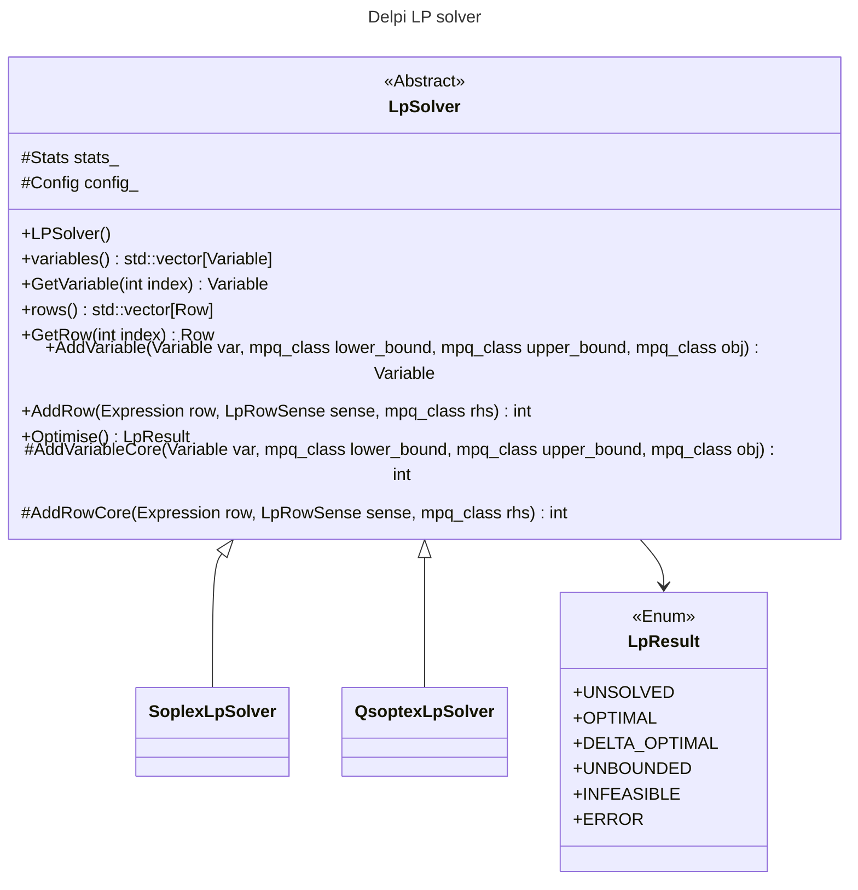
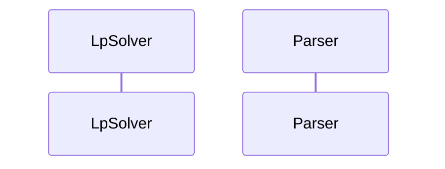

# Architecture

```mermaid
---
title: Delpi LP solver
---
classDiagram

    class LpResult {
        <<Enum>>
        +UNSOLVED
        +OPTIMAL
        +DELTA_OPTIMAL
        +UNBOUNDED
        +INFEASIBLE
        +ERROR
    }

    class LpSolver {
        <<Abstract>>
        #Stats stats_
        #Config config_

        +LPSolver()

        +variables() std::vector[Variable]
        +GetVariable(int index) Variable
        +rows() std::vector[Row]
        +GetRow(int index) Row

        +AddVariable(Variable var, mpq_class lower_bound, mpq_class upper_bound, mpq_class obj) Variable
        +AddRow(Expression row, LpRowSense sense, mpq_class rhs) int

        +Optimise() LpResult

        #AddVariableCore(Variable var, mpq_class lower_bound, mpq_class upper_bound, mpq_class obj) int
        #AddRowCore(Expression row, LpRowSense sense, mpq_class rhs) int
    }

    class SoplexLpSolver { }
    class QsoptexLpSolver { }


    LpSolver <|-- SoplexLpSolver
    LpSolver <|-- QsoptexLpSolver

    LpSolver --> LpResult
```

# Sequence Diagram

```mermaid
sequenceDiagram
    participant LpSolver
    participant Parser


```
