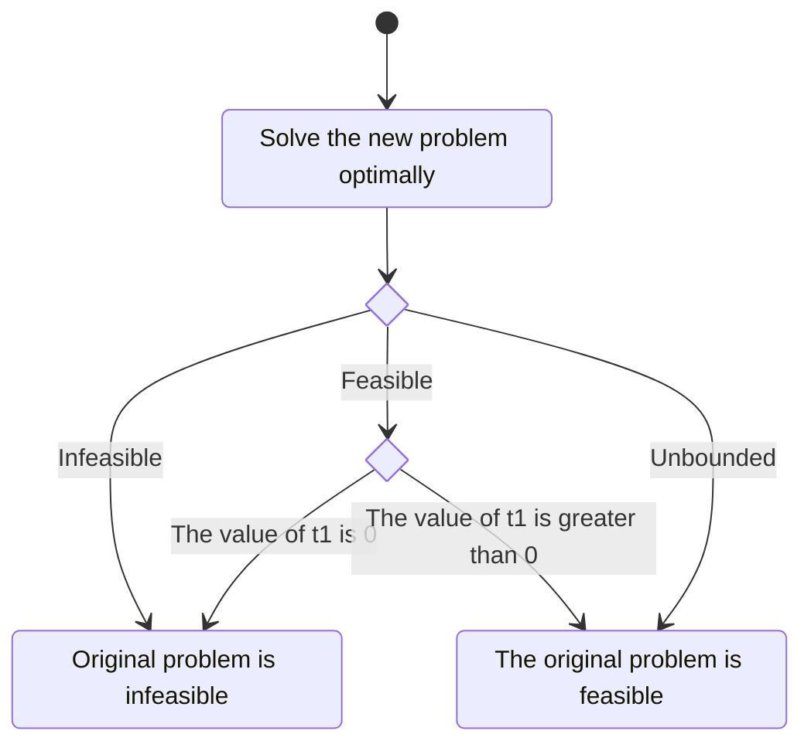

# Theory

Theory behind the solver.
While its knowledge is not necessary to use the solver, it can be useful to understand how it works, especially when debugging or extending its features.

## Linear Programming

A **LP** problem is an optimization problem where the objective function and the constraints are linear equalities or inequalities.
The objective function is what we want to maximise or minimise, while the constraints are the conditions the solution must satisfy.
The standard form of a **LP** problem is the following:

$$
\begin{equation*}
    \begin{aligned}
         & \max              & c^T x      \newline
         & \text{subject to} & A x \leq b \newline
         &                   & x \geq 0
    \end{aligned}
\end{equation*}
$$

where $x \in \mathbb{R}^d$ is the vector of variables to be determined, $c \in \mathbb{R}^d$ and $b \in \mathbb{R}^n$ are vectors of coefficients, and $A \in \mathbb{R}^{n \times d}$ is a matrix of coefficients.
It is always possible to rewrite a **LP** problem in standard form following these steps:

- If the problem is a minimization problem, it is sufficient to multiply the objective function by $-1$ to obtain the corresponding maximization problem.
- If some variables have no lower bound, they can be substituted with the difference of two variables, both with a lower bound of $0$ (i.e. $x = x_1 - x_2$ and $x_1, x_2 \geq 0$).
- If strict equalities exist, they can be substituted with two inequalities (i.e. $x = 0$ becomes $x \leq 0$ and $x \geq 0$).
- If there are some inequalities with different signs, one can be multiplied by $-1$ to ensure both have the same sign.
  \end{itemize}

**LP** problems are usually solved via the simplex method, although some interior-point methods [^paper:interior-point] may be used as well.
The simplex method is an iterative algorithm developed by George Dantzig in 1947 [^paper:simplex].
To apply the simplex method, the problem must be converted in _slack form_ to use the simplex method.
Starting with a **LP** problem in standard form, the slack form is obtained by introducing a slack variable for each constraint so that the inequality becomes an equality.
The slack variables must also be non-negative.

It is possible to extract an invertible squared matrix $B$ from $A$ of dimension $n \times n$ called basis.
The remaining columns of $A$ form the $N$ matrix.

$$
\begin{equation*}
    A = \begin{bmatrix}
        B & N
    \end{bmatrix}
    \text{, where }
    \begin{cases}
        B \in \mathbb{R}^{n \times n} \newline
        N \in \mathbb{R}^{n \times (d - n)}
    \end{cases}
\end{equation*}
$$

The variables $x_i$ corresponding to the columns of $B$ are called _basic variables_, while the ones that end up in $N$ _non-basic variables_.

With this framework, it is possible to define a tableau.
Each row of the tableau corresponds to a constraint.
An additional row called _objective row_, is added to represent the objective function associated with a special variable $z$.
All the original variables are considered _non-basic_, while the slack variables are _basic_.

$$
\begin{equation*}
    \begin{array}{c}
        \newline
        z   \newline
        s_1 \newline
        s_2 \newline
        s_3
    \end{array}
    \begin{bmatrix}
        \begin{array}{c|cccccc|c}
            z & x_1    & x_2    & x_3    & s_1 & s_2 & s_3 & b   \newline \hline
            1 & -c_1   & -c_2   & -c_3   & 0   & 0   & 0   & 0   \newline \hline
            0 & a_{11} & a_{12} & a_{13} & 1   & 0   & 0   & b_1 \newline
            0 & a_{21} & a_{22} & a_{23} & 0   & 1   & 0   & b_2 \newline
            0 & a_{31} & a_{23} & a_{33} & 0   & 0   & 1   & b_3 \newline
        \end{array}
    \end{bmatrix}
\end{equation*}
$$

To iterate the simplex method, the following steps are performed:

- Find the pivot column $j$, which is the column with the most negative coefficient in the objective row.
- Find the pivot row $i$, which is the row with the smallest ratio between the constant term $b_i$ and the coefficient of the pivot column.
- Divide the pivot row by the coefficient of the pivot column so that the value in position $(i, j)$ becomes $1$.
- All other rows must contain the value $0$ along the pivot column. This is achieved by subtracting the pivot row multiplied by the coefficient of the pivot column.
- The variable corresponding to the pivot column becomes basic, while the one corresponding to the pivot row on the left of the tableau becomes non-basic.
- Repeat until the objective row has no negative coefficients.

The solution is obtained by reading the corresponding value from the tableau's last column, while the objective function's value can be found in the top right corner.

### Farkas' lemma

To prove that an **LP** problem is feasible, it is sufficient to find a vector $x$ and verify that $Ax \le b$.
It is possible to find a similar proof for the infeasibility of a problem.

The _Farkas' lemma_ states that only one of the following two statements is true for a given pair $(A, b)$:

$$
\begin{array}{l}
    \exists x : Ax \le b \newline
    \newline
    \exists y : y^T A \le 0 \land y^T b > 0
\end{array}
$$

For **LP** problems, the vector $y$ is obtained by solving the dual problem.
Consider the following **LP** problem:

$$
\begin{equation*}
    \begin{aligned}
         & \max              & c^T x      \newline
         & \text{subject to} & A x \geq b \newline
         &                   & x \geq 0
    \end{aligned}
\end{equation*}
$$

The corresponding dual problem is:

$$
\begin{equation*}
    \begin{aligned}
         & \min              & b^T y      \newline
         & \text{subject to} & A^T y \le c \newline
         &                   & y \geq 0
    \end{aligned}
\end{equation*}
$$

By the _weak duality theorem_, it is possible to use the extreme ray from the unbounded dual problem to construct the vector $y$, called **Farkas' Ray**, that satisfies Farkas' lemma.

## SMT and Linear Programming

Even when working within the same problem space, many differences exist between **LP** and **SMT** solvers.
**LP** solvers can only deal with conjunctions of constraints (i.e. all constraints must be satisfied) and focus on finding the optimal solution to the problem.
Some approximation errors are introduced when operating with floating point arithmetic.
But after years of research and interest in the subject, modern **LP** solvers have become highly efficient and reliable.
On the other hand, **SMT** solvers can deal with arbitrary boolean combinations of constraints and focus on finding an assignment that satisfies the formula without any guarantee of the solution's optimality.
There has been a lot of interest in incorporating **LP** solvers into a modern SMT solver [^paper:lp-for-smt].

In **QF-LRA**, the atoms of a formula propositional variables defined by equalities or inequalities in the form:

$$
\begin{equation*}
    a_1 x_1 + a_2 x_2 + \dots + a_n x_n \bowtie b
\end{equation*}
$$

where $a_1, a_2, \dots, a_n, x_1, x_2, \dots, x_n, b \in \mathbb{Q}$ and $\bowtie \in \{ =, \neq, \leq, \geq, <, > \}$.

Deciding the satisfiability of these components is usually done using a **LP** solver, which, in turn, usually relies on the simplex method.

### The problem of feasibility

Consider the following LP problem:

$$
\begin{equation*}
    \begin{aligned}
         & \max              & c^T x      \newline
         & \text{subject to} & A x \leq b \newline
         &                   & x \geq 0
    \end{aligned}
\end{equation*}
$$

or the equivalent expanded form:

$$
\begin{array}{lll}
\max \quad & c_1 x_1 + c_2 x_2 + \dots + c_n x_n \newline
\text{s.t.} \quad & a_{11} x_1 + a_{12} x_2 + \dots + a_{1n} x_n \le b_1 \newline
& a_{21} x_1 + a_{22} x_2 + \dots + a_{2n} x_n \le b_2 \newline
& \vdots \newline
& a_{m1} x_1 + a_{m2} x_2 + \dots + a_{mn} x_n \le b_m \newline
& x_i \ge 0, \quad i = 1, 2, \dots, n
\end{array}
$$

with $c_i, a_{ij}, b_j \in \mathbb{R}$ and $i = 1, 2, \dots, n$, $j = 1, 2, \dots, m$.

<!-- New subsection -->

Since we are only interested in the feasibility of the problem, we can assume that the objective function is a constant, i.e., $0$.

$$
\begin{align*}
\max \quad & 0 \newline
\text{s.t.} \quad & a_{11} x_1 + a_{12} x_2 + \dots + a_{1n} x_n \le b_1 \newline
& a_{21} x_1 + a_{22} x_2 + \dots + a_{2n} x_n \le b_2 \newline
& \vdots \newline
& a_{m1} x_1 + a_{m2} x_2 + \dots + a_{mn} x_n \le b_m \newline
& x_i \ge 0, \quad i = 1, 2, \dots, n
\end{align*}
$$

Solving the problem with an LP solver will give us the feasibility of the problem.

<!-- New section -->

### Irreducible Infeasible Set (IIS)

An _Irreducible Infeasible Set_ is a subset of the constraints and bounds that cause the **LP** problem to be infeasible.
Removing any constraint from the set will make the problem feasible.

Such a set can be computed by considering the **Farkas' ray**.
If the bounds on the variable are not just $\ge 0$, some operations must take place to ensure they are properly considered in the set.

Assume we have a problem in the form:

$$
\begin{align*}
\max \quad & 0 \newline
\text{s.t.} \quad & a_{11} x_1 + a_{12} x_2 + \dots + a_{1n} x_n \le b_1 \newline
& \vdots \newline
& a_{m1} x_1 + a_{m2} x_2 + \dots + a_{mn} x_n \le b_m \newline
& x_i \ge l_i, \quad i = 1, 2, \dots, n \newline
& x_i \le u_i, \quad i = 1, 2, \dots, n
\end{align*}
$$

Let $y$ be the standard **Farkas' ray**, which corresponds to a dual problem's feasible solution.
Set $q^T = y^TA$ and define a vector $z$ such that

$$
z = \begin{cases}
l_j & \text{if } q_j < 0 \newline
u_j & \text{if } q_j \ge 0 \newline
\end{cases}
$$

The key property of such certificate is that it will satisfy $q^Tz = y^TAz < y^Tb$.

# TODO: expand on the topic

### Strict inequalities

Let's now consider the case where a strict inequality is present.

$$
\begin{align*}
\max \quad & 0 \newline
\text{s.t.} \quad & a_{11} x_1 + a_{12} x_2 + \dots + a_{1n} x_n < b_1 \newline
& \vdots \newline
& x_i \ge 0, \quad i = 1, 2, \dots, n
\end{align*}
$$

<!-- New subsection -->

#### How to deal with strict inequalities

Simplex based LP solvers have to either

- use a symbolic delta to the right-hand side of the inequality
  - requires a rational solver
- add a small real value $\epsilon$ to differentiate the left-hand side from the right-hand side of the inequality
  - adds an arbitrary error to the problem (what if $\epsilon$ is too small?)

<!-- New subsection -->

#### Alternative: Problem transformation

Maybe we could leverage the fact that we don't have an objective function and transform the problem in a way that allows us to check for feasibility on a problem with strict inequalities with a standard LP solver.

$$
\begin{array}{ll}
\max \quad & 0 \newline
\text{s.t.} \quad & a_{11} x_1 + a_{12} x_2 + \dots + a_{1n} x_n < b_1 \newline
& \vdots \newline
& x_i \ge 0, \quad i = 1, 2, \dots, n
\end{array}
$$

<!-- .element: class="fragment fade-in-then-out m-unset" -->

$$
\begin{align*}
\max \quad & 0 \newline
\text{s.t.} \quad & a_{11} x_1 + a_{12} x_2 + \dots + a_{1n} x_n + t_1 \le b_1 \newline
& \vdots \newline
& x_i \ge 0, \quad i = 1, 2, \dots, n \newline
& t_1 > 0
\end{align*}
$$

<!-- .element: class="fragment fade-in-then-out m-unset" -->

$$
\begin{align*}
\max \quad & t_1 \newline
\text{s.t.} \quad & a_{11} x_1 + a_{12} x_2 + \dots + a_{1n} x_n + t_1 \le b_1 \newline
& \vdots \newline
& x_i \ge 0, \quad i = 1, 2, \dots, n \newline
& t_1 \ge 0
\end{align*}
$$

<!-- .element: class="fragment fade-in-then-out m-unset" -->

<!-- New subsection -->

#### How to read the results

Since we are maximising $t_1$, if the problem is feasible, the solver will return a value of $t_1$ greater than $0$ if the problem allows it.

<!-- New subsection -->

#### Avoid unboundedness

Since to verify that a problem is unbounded can be tricky, we can add an arbitrary upper bound to the additional variable $t_1$.

$$
\begin{align*}
\max \quad & t_1 \newline
\text{s.t.} \quad & a_{11} x_1 + a_{12} x_2 + \dots + a_{1n} x_n + t_1 \le b_1 \newline
& \vdots \newline
& x_i \ge 0, \quad i = 1, 2, \dots, n \newline
& 0 \le t_1 \le 1
\end{align*}
$$

<!-- New subsection -->

#### Greater than inequalities

$$
\begin{align*}
\max \quad & 0 \newline
\text{s.t.} \quad & a_{11} x_1 + a_{12} x_2 + \dots + a_{1n} x_n > b_1 \newline
& \vdots \newline
& x_i \ge 0, \quad i = 1, 2, \dots, n \newline
\end{align*}
$$

<!-- .element: class="fragment fade-in-then-out m-unset" -->

$$
\begin{align*}
\max \quad & 0 \newline
\text{s.t.} \quad & -a_{11} x_1 - a_{12} x_2 - \dots - a_{1n} x_n < -b_1 \newline
& \vdots \newline
& x_i \ge 0, \quad i = 1, 2, \dots, n \newline
\end{align*}
$$

<!-- .element: class="fragment fade-in-then-out m-unset" -->

$$
\begin{align*}
\max \quad & t_1 \newline
\text{s.t.} \quad & -a_{11} x_1 - a_{12} x_2 - \dots - a_{1n} x_n + t_1 \le -b_1 \newline
& \vdots \newline
& x_i \ge 0, \quad i = 1, 2, \dots, n \newline
& t_1 \ge 0
\end{align*}
$$

<!-- .element: class="fragment fade-in-then-out m-unset" -->

<!-- New subsection -->

## Optimisation on not-equal constraints

Not equal constraints still represent the most expensive part of the solving process.
Each constraint is expanded into two inequalities, and the number of inequalities grows exponentially with the number of constraints.

Som heuristics can be used to optimise the process.

### Return as soon as one subproblem is solved

Since the problem is a disjunction of subproblems, if one subproblem is solved, the whole problem is solved.
Once it is found, all other subproblems can be discarded.

### If no non-equal constraint is violated and the problem is infeasible, return immediately

If no non-equal constraint is violated but the problem is not feasible, the issue is not with the non-equal constraints.
There is no point in enumerating all the other possibility.

### If a single non-equal constraint is violated, invert the sign of the constraint

If a single non-equal constraint is violated, changing the value of other not-equal constraints will not make the problem suddenly feasible.
We can prune the search space by inverting the sign of the constraint and solving the problem again.

Furthermore, if the problem is still infeasible under the same conditions, we can determine that the problem is unsatisfiable immediately.

### _If mutiple non-equal constraints are violated, try to find a subset of constraints that are violated (??)_

Some cases could be detected (and pruned) very easily without the need to invoke the solver

$$
\begin{align*}
\begin{cases}
x A_1 \ne b_1 \newline
x A_2 \ne b_2 \newline
x A_{3 \dots n} \le b_{3\dots n}
\end{cases}
\end{align*}
$$

This becomes

$$
\begin{cases}
x A_1 < b_1 \newline
x A_2 < b_2\newline
x A_{3 \dots n} \le b_{3\dots n}
\end{cases}
\
\lor
\
\begin{cases}
x A_1 > b_1 \newline
x A_2 < b_2 \newline
x A_{3 \dots n} \le b_{3\dots n}
\end{cases}
\
\lor
\
\begin{cases}
x A_1 < b_1 \newline
x A_2 > b_2 \newline
x A_{3 \dots n} \le b_{3\dots n}
\end{cases}
\
\lor
\
\begin{cases}
x A_1 > b_1 \newline
x A_2 > b_2 \newline
x A_{3 \dots n} \le b_{3\dots n}
\end{cases}
$$

How to find such cases?
What if we have more than two inequalities?

$$
\begin{cases}
x A_1 \ne b_1 \newline
x A_2 \ne b_2 \newline
x A_3 \ne b_3 \newline
x A_{3 \dots n} \le b_{3\dots n}
\end{cases}
$$

This becomes

$$
\begin{cases}
x A_1 < b_1 \newline
x A_2 < b_2 \newline
x A_3 < b_3 \newline
x A_{3 \dots n} \le b_{3\dots n}
\end{cases}
\
\lor
\
\begin{cases}
x A_1 > b_1 \newline
x A_2 < b_2 \newline
x A_3 < b_3 \newline
x A_{3 \dots n} \le b_{3\dots n}
\end{cases}
\
\lor
\
\begin{cases}
x A_1 < b_1 \newline
x A_2 > b_2 \newline
x A_3 < b_3 \newline
x A_{3 \dots n} \le b_{3\dots n}
\end{cases}
\
\lor
\
\begin{cases}
x A_1 > b_1 \newline
x A_2 > b_2 \newline
x A_3 < b_3 \newline
x A_{3 \dots n} \le b_{3\dots n}
\end{cases}
\
\lor
\
\begin{cases}
x A_1 < b_1 \newline
x A_2 < b_2 \newline
x A_3 > b_3 \newline
x A_{3 \dots n} \le b_{3\dots n}
\end{cases}
\
\lor
\
\begin{cases}
x A_1 > b_1 \newline
x A_2 < b_2 \newline
x A_3 > b_3 \newline
x A_{3 \dots n} \le b_{3\dots n}
\end{cases}
\
\lor
\
\begin{cases}
x A_1 < b_1 \newline
x A_2 > b_2 \newline
x A_3 > b_3 \newline
x A_{3 \dots n} \le b_{3\dots n}
\end{cases}
\
\lor
\
\begin{cases}
x A_1 > b_1 \newline
x A_2 > b_2 \newline
x A_3 > b_3 \newline
x A_{3 \dots n} \le b_{3\dots n}
\end{cases}
$$
